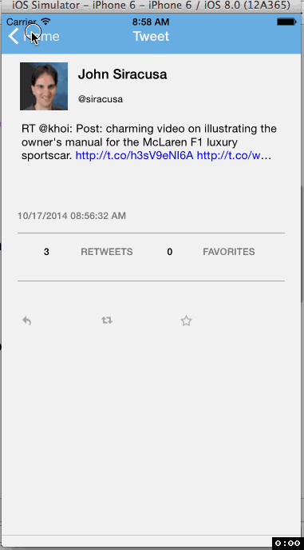

Tweet Redux Client [CodePath IOS Intro]
=============
This is an iOS Swift application for Twitter Client via [Twitter REST API](https://dev.twitter.com/rest/public) 
* Redux version is focused on implementing side menu (hamburger menu) by using UIscrollView 
* [First version without side menu](https://github.com/blky/Tweet.CodePath)
* Time spent: 15 hours spent in total

Completed user stories:
-------

 * Hamburger menu
  * Dragging anywhere in the view should reveal the menu.
  * The menu should include links to your profile, the home timeline, and the mentions view.
  * The menu can look similar to the LinkedIn menu below or feel free to take liberty with the UI
 * Contains the user header view
 * Contains a section with the users basic stats: # tweets, # following, # followers
 * Optional: Implement the paging view for the user description.

Stories not implemented:
-------

 * Home Timeline: Tapping on a user image should bring up that user's profile page
 * Optional: As the paging view moves, increase the opacity of the background screen. See the actual Twitter app for this effec
 * Optional: Pulling down the profile page should blur and resize the header image.
 * Optional: Account switching
  * Long press on tab bar to bring up Account view with animation
  * Tap account to switch to
  * Include a plus button to Add an Account
  * Swipe to delete an account

GIF created with [LiceCap](http://www.cockos.com/licecap/).
 

   
